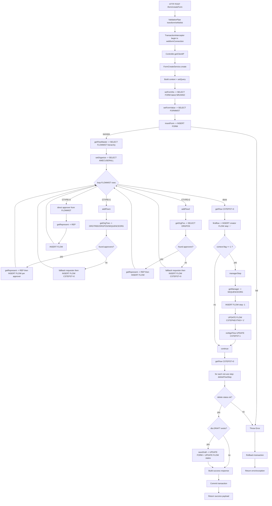

# Reverse Engineering Document: POST /form/createForm

**คำอธิบายภาพรวม:**
Endpoint นี้ใช้สร้างเอกสารคำขอ (FORM) พร้อมสร้างลำดับอนุมัติ (FLOW) อัตโนมัติตามแม่แบบการไหลงาน (FLOWMST) และโครงสร้างองค์กร โดยรองรับกรณีผู้แทนอนุมัติ, manager step, และการบันทึกเป็น draft ภายใต้ transaction ของฐานข้อมูล webformConnection

---

## 1. Endpoints & Route Configuration

- **HTTP Method:** POST
- **Path:** /form/createForm
- **Controller Prefix:** form
- **Guards / Interceptors / Pipes ที่ใช้:**
    - Guard: ไม่มีการประกาศในเมธอดนี้
    - Method Interceptor: AnyFilesInterceptor (รองรับ multipart/files แต่เมธอดไม่ได้อ่านไฟล์โดยตรง)
    - Transaction Metadata: UseTransaction("webformConnection")
    - Global Interceptor: TransactionInterceptor (ทำ begin/commit/rollback ตาม metadata)
    - Global Pipe: ValidationPipe (transform + whitelist จาก bootstrap)

---

## 2. Parameters & Payload (Data Structure)

- **Route Parameters (Param):** ไม่มี
- **Query Parameters (Query):** ไม่มี

- **Request Body (DTO): CreateFormDto**
    - สืบทอดจาก FormDto บางฟิลด์: NFRMNO, VORGNO, CYEAR
    - ฟิลด์ทั้งหมดที่รับจริง:

1. **NFRMNO**
    - Type: number
    - Validation: IsNotEmpty, IsNumber, Type(() => Number)
    - ความหมาย: หมายเลขแบบฟอร์ม (Form Master Number)

2. **VORGNO**
    - Type: string
    - Validation: IsNotEmpty, IsString, Type(() => String)
    - ความหมาย: รหัสองค์กร

3. **CYEAR**
    - Type: string
    - Validation: IsNotEmpty, IsString, Type(() => String)
    - ความหมาย: ปีงบประมาณ/ปีอ้างอิงหลัก

4. **REQBY**
    - Type: string
    - Validation: IsNotEmpty, IsString, Type(() => String)
    - ความหมาย: พนักงานผู้ร้องขอ

5. **INPUTBY**
    - Type: string
    - Validation: IsNotEmpty, IsString, Type(() => String)
    - ความหมาย: พนักงานผู้บันทึกข้อมูล

6. **REMARK**
    - Type: string (optional)
    - Validation: IsOptional, IsString, Type(() => String)
    - ความหมาย: หมายเหตุ

7. **DRAFT**
    - Type: string (optional)
    - Validation: IsOptional, IsString, Type(() => String)
    - ความหมาย: สถานะ draft ที่ต้องการบันทึก (ใช้ปรับ CST และ FLOW state เพิ่มเติม)

---

## 3. Step-by-Step Execution Workflow

1. Client เรียก POST /form/createForm พร้อม payload ตาม CreateFormDto
2. ValidationPipe แปลงชนิดข้อมูลและกรองฟิลด์นอก DTO (whitelist)
3. TransactionInterceptor ตรวจ metadata จาก UseTransaction("webformConnection") แล้วเปิด transaction ด้วย query runner ของ webformConnection
4. Controller ดึง IP จาก request ด้วย getClientIP
5. Controller ส่ง dto + ip ไปที่ FormCreateService.create
6. Service สร้าง context เริ่มต้น:
    - empno = REQBY
    - inputempno = INPUTBY
    - nfrmno/vorgno/cyear จาก dto
    - cyear2 = ปีปัจจุบันจากระบบ
    - CSTEPSTDX = 4 (ตัวนับสถานะ step)
7. เรียก setQuery เพื่อสร้าง key หลักของเอกสาร (NFRMNO, VORGNO, CYEAR, CYEAR2)
8. เรียก setFormNo:
    - query FORM ตาม key หลัก
    - หา NRUNNO ล่าสุด (DESC, take 1)
    - ถ้ามีข้อมูล: nrunno = ล่าสุด + 1, ถ้าไม่มี: nrunno = 1
9. เรียก setFormValue:
    - query FORMMST หา metadata ของแบบฟอร์ม
    - เตรียม object FORM ที่จะ insert (VREQNO, VINPUTER, DREQDATE, CREQTIME, VFORMPAGE, VREMOTE, CST = 1)
10. เรียก insertForm:

- insert ลงตาราง FORM
- ถ้าล้มเหลว throw error เพื่อ rollback

11. เมื่อ insert FORM สำเร็จ:

- ตั้ง flag = 0
- โหลด flow master จาก FLOWMST ผ่าน getFlowMaster (hierarchical query เริ่มจาก CSTART = 1)

12. เรียก setOrganize:

- อ่านข้อมูลผู้ใช้จาก AMECUSERALL ผ่าน usersService.findEmp
- สรุป orgno สำหรับใช้คำนวณสายอนุมัติ (อิง sec/dep/div)

13. วนลูป flowMaster ทีละแถวตาม CTYPE:

- CTYPE = "1": เรียก addFlow1
    - หา org tree candidate ด้วย ORGTREE + ORGPOS + SEQUENCEORG
    - ถ้าพบผู้อนุมัติ: สร้าง FLOW หลายแถวตามผู้อนุมัติที่เจอ
    - ถ้าไม่พบ: fallback ใส่ approver เป็นผู้ขอเอง, CSTEPST = 0
- CTYPE = "2": เรียก addFlow2
    - หา approver จาก ORGPOS ตามตำแหน่งและ org ที่กำหนดใน flow master
    - ถ้าพบ: insert FLOW ตามผู้อนุมัติที่พบ
    - ถ้าไม่พบ: fallback ผู้ขอเอง, CSTEPST = 0
- CTYPE = "3": direct approver
    - ใช้ VAPVNO จาก FLOWMST
    - คำนวณ CSTEPST จาก CSTEPSTDX
    - แปลงผู้แทนผ่าน REP (getRepresent)
    - insert FLOW

14. หลังจบลูป:

- ตั้ง query CSTEPST = "3" และ NRUNNO ปัจจุบัน
- เรียก flowService.getFlow หา step ที่ ready

15. เรียก firstflow:

- insert FLOW ของ requester เป็น CSTEPNO = "--", CSTART = "1", CSTEPST = "5" (อนุมัติแล้วในฐานะผู้สร้าง)
- CSTEPNEXTNO ชี้ไป step แรกที่ต้องอนุมัติต่อ หรือ "00" ถ้าไม่มี

16. ตรวจ manager step:

- ถ้า flag == 1 (มักหมายถึงไม่เจอตำแหน่งตาม ORGPOS ใน addFlow1) ให้เรียก managerStep
- managerStep จะ:
    - หา manager จาก SEQUENCEORG
    - insert step พิเศษ CSTEPNO = "-1"
    - update flow ที่ CSTART = 1 ให้ CSTEPNEXTNO = "-1"
    - reAlignFlow ลดค่า CSTEPST ของ flow อื่นที่อยู่ช่วง >1 และ <5 ลง 1

17. cleanup flow ที่ไม่ใช้:

- ตั้ง query CSTEPST = "0"
- ดึง flow not-use ทั้งหมด
- ลบทีละ step ด้วย deleteFlowStepService.deleteFlowStep
- หากลบไม่ได้ ให้ throw error

18. ถ้ามี dto.DRAFT:

- เรียก saveDraft
- update FORM.CST = DRAFT
- update FLOW ที่ CSTEPST 2..5 ให้เป็นสถานะ draft-friendly ตามกฎในโค้ด

19. ส่ง response success:

- status = true
- ส่ง runno, empno, formtype, owner, cyear, cyear2, next_approve

20. หากเกิด exception จุดใดก็ตาม:

- service throw error ขึ้นไป
- TransactionInterceptor rollback transaction บน webformConnection
- ส่ง error response ผ่านระบบ exception ของ NestJS

**หมายเหตุสำคัญด้าน Transaction:**
การอ่านข้อมูลจาก services ที่ใช้ connection อื่น (เช่น usersService ที่ไป amecConnection) ไม่ได้อยู่ใน transaction เดียวกับ webformConnection โดยตรง เพราะ BaseRepository จะใช้ tx manager เฉพาะ connection ที่ตรงกันเท่านั้น

---

## 4. Sub-functions & Helper Functions (ฟังก์ชั่นย่อย)

### ฟังก์ชั่นย่อยที่ 1: setQuery(context)

- **หน้าที่:** สร้าง key หลักสำหรับ query เอกสาร
- **Parameters:** context (FormContext)
- **Return Value:** void (แก้ค่าใน context.query)
- **ขั้นตอนการทำงานย่อย:** map NFRMNO/VORGNO/CYEAR/CYEAR2 ลง query object

### ฟังก์ชั่นย่อยที่ 2: setFormNo(context)

- **หน้าที่:** หาเลขรัน NRUNNO ถัดไป
- **Parameters:** context (FormContext)
- **Return Value:** Promise<void>
- **ขั้นตอนการทำงานย่อย:** query FORM ล่าสุดด้วย key หลัก แล้ว +1 หรือเริ่ม 1

### ฟังก์ชั่นย่อยที่ 3: setFormValue(context)

- **หน้าที่:** เตรียม payload สำหรับ insert FORM
- **Parameters:** context (FormContext)
- **Return Value:** Promise<object> (ข้อมูลรูปแบบ FormWebformDto)
- **ขั้นตอนการทำงานย่อย:** query FORMMST เพื่ออ่าน VFORMPAGE แล้วประกอบข้อมูลวันที่/เวลา/ผู้สร้าง/IP

### ฟังก์ชั่นย่อยที่ 4: insertForm(formData)

- **หน้าที่:** บันทึก FORM ลงฐานข้อมูล
- **Parameters:** formData (FormWebformDto)
- **Return Value:** Promise<boolean>
- **ขั้นตอนการทำงานย่อย:** เรียก FormRepository.create (TypeORM save)

### ฟังก์ชั่นย่อยที่ 5: setOrganize(context)

- **หน้าที่:** คำนวณ orgno จากข้อมูลพนักงาน
- **Parameters:** context (FormContext)
- **Return Value:** Promise<void>
- **ขั้นตอนการทำงานย่อย:** อ่าน AMECUSERALL แล้วเลือก SDIVCODE/SDEPCODE/SSECCODE ตามเงื่อนไข

### ฟังก์ชั่นย่อยที่ 6: addFlow1(data, context)

- **หน้าที่:** สร้าง flow สำหรับ CTYPE 1 (ผ่านโครงสร้างองค์กร)
- **Parameters:** data (FLOWMST row), context (FormContext)
- **Return Value:** Promise<void>
- **ขั้นตอนการทำงานย่อย:** query org tree, หา representative, setFlow, insertFlow (หรือ fallback ผู้ขอเอง)

### ฟังก์ชั่นย่อยที่ 7: addFlow2(data, context)

- **หน้าที่:** สร้าง flow สำหรับ CTYPE 2 (ผ่าน ORGPOS โดยตรง)
- **Parameters:** data (FLOWMST row), context (FormContext)
- **Return Value:** Promise<void>
- **ขั้นตอนการทำงานย่อย:** query ORGPOS ตาม VPOSNO+VAPVORGNO, แปลง representative, insert FLOW

### ฟังก์ชั่นย่อยที่ 8: getRepresent(empno, context)

- **หน้าที่:** resolve ผู้แทนอนุมัติ
- **Parameters:** empno (string), context (FormContext)
- **Return Value:** Promise<void> (เก็บลง context.represent)
- **ขั้นตอนการทำงานย่อย:** query REP ด้วย (NFRMNO,VORGNO,CYEAR,VEMPNO)

### ฟังก์ชั่นย่อยที่ 9: setFlow(data, context)

- **หน้าที่:** แปลงข้อมูล FLOWMST + context เป็น CreateFlowDto
- **Parameters:** data (FLOWMST row), context (FormContext)
- **Return Value:** object (flow payload)
- **ขั้นตอนการทำงานย่อย:** map ค่าคีย์หลัก, step, approver, representative, URL และ policy fields

### ฟังก์ชั่นย่อยที่ 10: firstflow(data, context)

- **หน้าที่:** สร้าง step เริ่มต้นของ requester
- **Parameters:** data (ready flow array), context (FormContext)
- **Return Value:** Promise<void>
- **ขั้นตอนการทำงานย่อย:** insert FLOW CSTEPNO "--", CSTART "1", CSTEPST "5"

### ฟังก์ชั่นย่อยที่ 11: managerStep(context, managerData)

- **หน้าที่:** แทรก manager approval step กรณีพิเศษ
- **Parameters:** context (FormContext), managerData (UpdateFlowDto; default CEXTDATA="MG", CAPPLYALL="3")
- **Return Value:** Promise<void>
- **ขั้นตอนการทำงานย่อย:** query manager, insert CSTEPNO "-1", อัปเดตลิงก์ CSTEPNEXTNO และ re-align CSTEPST

### ฟังก์ชั่นย่อยที่ 12: saveDraft(draft, context)

- **หน้าที่:** ปรับเอกสารและ flow ให้อยู่ในสถานะ draft
- **Parameters:** draft (string), context (FormContext)
- **Return Value:** Promise<void>
- **ขั้นตอนการทำงานย่อย:** update FORM.CST และ reset fields ของ FLOW บางสถานะ

### ฟังก์ชั่นย่อยที่ 13: deleteFlowStep(dto)

- **หน้าที่:** ลบ flow step ที่ไม่ใช้งาน พร้อมปรับ pointer ของ flow เดิม
- **Parameters:** dto (DeleteFlowStepDto)
- **Return Value:** Promise<{status:boolean, message:string}>
- **ขั้นตอนการทำงานย่อย:** update prev/next/start แล้ว delete flow step เป้าหมาย

---

## 5. Database Interaction & Tables Used

### ตารางหลักที่เกี่ยวข้อง

1. **WEBFORM.FORM**
    - Operations:
        - SELECT ล่าสุดเพื่อหา NRUNNO ถัดไป
        - INSERT เอกสารใหม่
        - UPDATE สถานะ draft (กรณีมี DRAFT)
    - Query/ORM:
        - find where composite key (NFRMNO,VORGNO,CYEAR,CYEAR2)
        - order by NRUNNO DESC take 1
        - save/update ผ่าน TypeORM repository

2. **WEBFORM.FLOW**
    - Operations:
        - INSERT หลายแถวสำหรับแต่ละ approval step
        - SELECT step ตามเงื่อนไข CSTEPST/NRUNNO
        - UPDATE CSTEPNEXTNO/CSTEPST และข้อมูล manager alignment
        - DELETE step ที่ไม่ใช้งาน (ผ่าน deleteFlowStep)
    - Query/ORM:
        - dynamic where จาก SearchFlowDto
        - update แบบ condition object
        - reAlignFlow ใช้ SQL expression CSTEPST = CSTEPST - 1 where 1 < CSTEPST < 5

3. **WEBFORM.FLOWMST**
    - Operations: SELECT โครงสร้าง flow master
    - Query/ORM:
        - Oracle hierarchical query (START WITH ... CONNECT BY ...)
        - เริ่มจาก CSTART = '1' เพื่อไล่ chain ของ step

4. **WEBFORM.FORMMST**
    - Operations: SELECT metadata ฟอร์ม (VFORMPAGE, VANAME ฯลฯ)
    - Query/ORM:
        - where NNO + VORGNO + CYEAR
        - ใช้ตอน setFormValue และ managerStep

5. **WEBFORM.ORGTREE**
    - Operations: SELECT hierarchy ของ org
    - Query/ORM:
        - hierarchical query หา VORGNO chain ขององค์กร

6. **WEBFORM.ORGPOS**
    - Operations: SELECT ผู้ครองตำแหน่งใน org
    - Query/ORM:
        - where VPOSNO + VORGNO
        - ใช้ทั้งใน addFlow1 (ผ่าน query ดิบร่วม ORGTREE) และ addFlow2 (repository find)

7. **WEBFORM.SEQUENCEORG**
    - Operations: SELECT manager/chain
    - Query/ORM:
        - getManager: where EMPNO + ตรง SPOSCODE ของพนักงานใน AMECUSERALL
        - ใช้สำหรับ manager step และเงื่อนไข org tree query

8. **WEBFORM.REP**
    - Operations: SELECT ตัวแทนอนุมัติ
    - Query/ORM:
        - where NFRMNO + VORGNO + CYEAR + VEMPNO
        - fallback: ถ้าไม่พบใช้พนักงานเดิมเป็นผู้อนุมัติแทน

9. **AMEC.AMECUSERALL** (ผ่าน amecConnection และบางจุด join)
    - Operations: SELECT ข้อมูลพนักงานผู้ยื่นคำขอ/ตำแหน่ง
    - Query/ORM:
        - usersService.findEmp(EMPNO) เพื่ออ่าน SPOSCODE/SSECCODE/SDEPCODE/SDIVCODE
    - หมายเหตุ: อยู่นอก transaction ของ webformConnection

---

## 6. System Flowchart (Mermaid Syntax)

